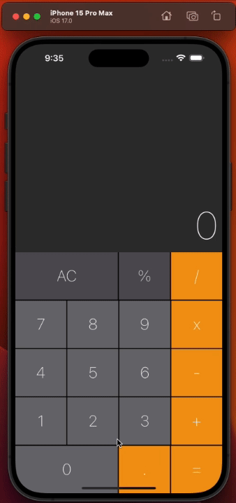

---

## Calculator App

---

<div align="center">

**Language:**

[](README.md)
[](README.pt-br.md)

</div>

---
## ℹ️ About this repository
Calculator App in the MacOS calculator style.

This repository's main objective is to demonstrate the application developed to train my knowledge during the Flutter course from the company [COD3R](https://www.udemy.com/course/curso-flutter/).

---
## ⚙️ Features
This application has the following features:

- Perform basic operations (+, -, *, /, %).
- Interface similar to the MacOS calculator.

---
## 👁️ Preview

<h1 align="center">

</h1>

---
## 🧪 Tecnologias
Este projeto foi desenvolvido usando as seguintes tecnologias:

- [Flutter 3.16.9](https://docs.flutter.dev/)
- [Dart 3.2.6](https://dart.dev/)

---
## ⚡ Technologies

This project was developed using the following technologies:

```bash
  git clone https://github.com/GoedertDalmolin/calculator.git
  cd calculator
```

Finally compile and run the project.

---
</> Developed by [GoedertDalmolin](https://github.com/GoedertDalmolin) 👋
---
